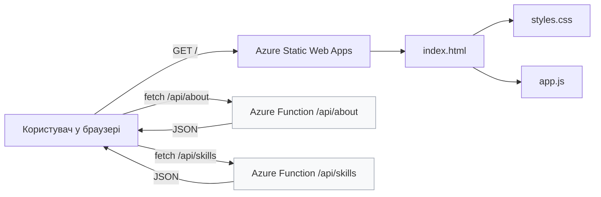

# My Portfolio

Це простий портфельний сайт з використанням Azure Static Web Apps та Azure Functions. Проєкт містить головну сторінку, стилі, JavaScript для взаємодії з бекендом та серверні функції, які повертають дані студента й навичок.

## Опис проєкту

Основна ідея — показати портфоліо студента з інформацією про себе, список навичок та інтерактивний віджет рівня володіння навичками, який завантажується з API. Сайт розгорнутий як статичний фронтенд, а логіка API реалізована як серверні функції Azure.

## Архітектура

## Файли проєкту

- `index.html` — головна сторінка з інформацією про студента, секцією навичок та місцем для відображення даних з API.
- `styles.css` — стильова тема сайту, включно зі світлою та темною темами, прогрес-барами для навичок і оформленням карток.
- `app.js` — логіка клієнта: завантаження даних з API, відображення прогрес-барів та перемикання тематичних режимів з `localStorage`.
- `api/about/__init__.py` — Azure Function, яка повертає інформацію про студента у форматі JSON.
- `api/about/function.json` — конфігурація тригера HTTP для функції `/api/about`.
- `api/skills/__init__.py` — Azure Function, яка повертає список навичок із рівнями володіння.
- `api/skills/function.json` — конфігурація тригера HTTP для функції `/api/skills`.
- `.github/workflows/azure-static-web-apps-victorious-pond-0f1778d03.yml` — GitHub Actions для CI/CD, що розгортає сайт на Azure Static Web Apps при пуші в `main`.

## Розгортання

Сайт розгорнуто на Azure Static Web Apps. Після коміту в гілку `main` автоматично виконується CI/CD і сайт оновлюється.

### Посилання на розгорнутий сайт

[https://victorious-pond-0f1778d03.7.azurestaticapps.net/]
